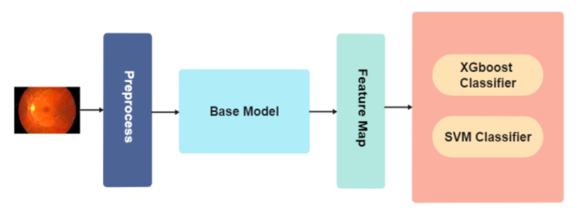

[](https://github.com/Asiyeh-Bahaloo/eye_disease/graphs/commit-activity)
# Multi-label detection of ophthalmic disorders using InceptionResNetV2 on multiple datasets

This repository contains the implementation of [paper](https://ieeexplore.ieee.org/document/10043998s) "Multi-label detection of ophthalmic disorders using InceptionResNetV2 on multiple datasets".

# Table of Contents  
1. [Description](#description)  
2. [How to Run?](#how-to-run)  
3. [Method](#method) 
4. [Result](#result)

# Description
Recently, AI-based methods have been extensively used to help in the process of diagnosing eye diseases due to their prevalence.
The available implementation can diagnose 8 different eye dieses from a medical fundas image of the eye.

# How to Run?
Clone the repo:
```bash
git clone https://github.com/Asiyeh-Bahaloo/eye_disease.git
```
Then cd into the repository:
```bash
cd eye_disease
```
This project has a proper docker-compose and docker-file for both development and production purposes. If you are familiar with docker and have docker installed run the command below:
```bash
sudo docker-compose -f docker-compose.dev.yml up
```
If you are more used to python environments then install all the dependencies:
```bash
pip install -r requirements.dev.txt
```
Now, you can generate a detailed document about the implementation with:
```bash
cd docs/sphinx

sphinx-build -b html ./source ./build
```

Every training and validation experiment has it's own script in the script folder. They work in the same manner, so here is an example to train the model
```bash
python  scripts/train_xception_imp.py \
 --batch_size 32 --epochs 0 --pre_epochs=100 --patience 8 --loss "binary_crossentropy" \
 --imgnetweights "True"  --data_train "/data/ODIR-5K_Training_Dataset"   --data_val "path_to_ODIR-5K_VAL_Dataset" \
 --train_label "path_to_odir_train.csv" --val_label "path_to_odir_val.csv" \
 --result "path_to_save_results" --learning_rate 0.05 \
 --LR_type "other" --LR_decay_rate 0.95 --LR_decay_step 50 \
 --decay_rate 1e-6 --momentum_rate 0.9 --nesterov_flag "True" \
 --exp "exp name" --bg_scale 350 --shape 224 --keep_AR "False" \
 --data_frac 1 --ES_mode "min" --ES_monitor "val_loss" --ES_verbose 1  \
 --Auth_name "Your Name" --desc "experiment_desciption" \
--dropout_rate 0.25 --weight_decay_rate 0.3
```
This project uses MLflow for keeping the records of experiments. So after training you can call the Mlflow UI to see the important diagrams:

```bash
mlflow ui --backend-store-uri path_to_mlflow_folder
```
# Method
The proposed architecture has shown in the image below:

We trained and compared 5 different base model for this experiment:
1. VGG16
2. VGG19
3. Resnet_V2
4. Inception_V3
5. Xception
Please read the paper for more information about the methodology.
## Datasets
We have used and combined two datasets to train our models:
1. ODIR_2019 dataset [(downlaod)](https://odir2019.grand-challenge.org/dataset/):  
   This dataset is real-life set of patient information collected by Shanggong Medical Technology Co., Ltd. from different hospitals/medical centers in China. In these institutions, fundus images are captured by various cameras in the market, such as Canon, Zeiss and Kowa, resulting into varied image resolutions. 

2. Cataract dataset [(downlaod)](https://www.kaggle.com/jr2ngb/cataractdataset): 
     Cataract and normal eye image dataset for cataract detection.

After exploring datasets, we used some preprocessing techniques to improve images: 
1. Resize images : We resized images to 224*224 pixels
2. Remove padding : We removed the padding around the fundas image and cropped uninformative area to detect lesions better.
3. Ben_Graham Method : Ben Graham (Kaggle competition's winner) share insightful way to improve lighting condition. Here, we applied his idea, and we could see many important details in the eyes much better. 

# Result

The Resnet_V2 model traiend with XGboost head has performed the best among other model with validation final score of 0.677%. 
Here is the evaluation result with 5896 training images and 655 validation images. For more details about configuration details please refer to the paper.

   Training: 

| accuracy | auc    | loss   | precision | recall |
| -------- | ------ | ------ | --------- | ------ |
| 0.9511   | 0.9771 | 0.1249 | 0.8721    | 0.7449 |

   Validation:

| accuracy | auc    | loss   | precision | recall |
| -------- | ------ | ------ | --------- | ------ |
| 0.8403   | 0.7779 | 0.5965 | 0.3778    | 0.3559 |

